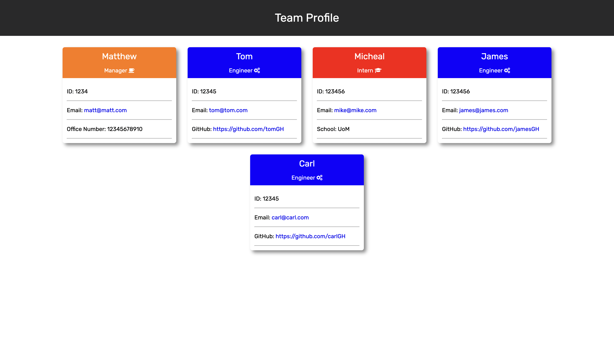

# Team Profile Generator

## Contents

- [Description](#Description)
- [Installation](#Installation)
- [Usage](#Usage)
- [Testing](#Testing)
- [Questions](#Questions)

## Description

For this project, I have built a command-line app that generates a team profile. It is built using HTML, CSS, JavaScript and Node.js. By entering information via the command-line, a HTML team profile page will be generated (example below). Please see the usage section for more information on how to use this application.



You can see a demo of the application here - https://watch.screencastify.com/v/DoGGbkidUy1D8vE3NBZj

You can see a demo of the tests passing here - https://watch.screencastify.com/v/VNLqqDXjl43t8NahQKcr

## Installation

To install this project, simple clone the repository, then run the below command to install all dependencies.

```
npm i
```

## Usage

Firstly, to use this app, make sure you have node.js installed. Once installed, follow the below steps:

- To start the application, open your terminal and navigate to the folder where you have just cloned the repo and run the below command.

```
node index.js
```

- Once the application has started, you will be prompted for the team managers name, ID, email and phone number.
- Once you have entered the team managers information, you get the choice of adding an engineer, intern or if you are done, to exit the application and generate your team profile page.

## Testing

As you can see, there is a **tests** folder which includes tests for the 4 classes of employee, manager, engineer and intern. To run these tests, simply run the below command

```
npm run test
```

## Questions

If you have any questions, you can contact me via GitHub or email me at mattwilliamsdev@gmail.com
